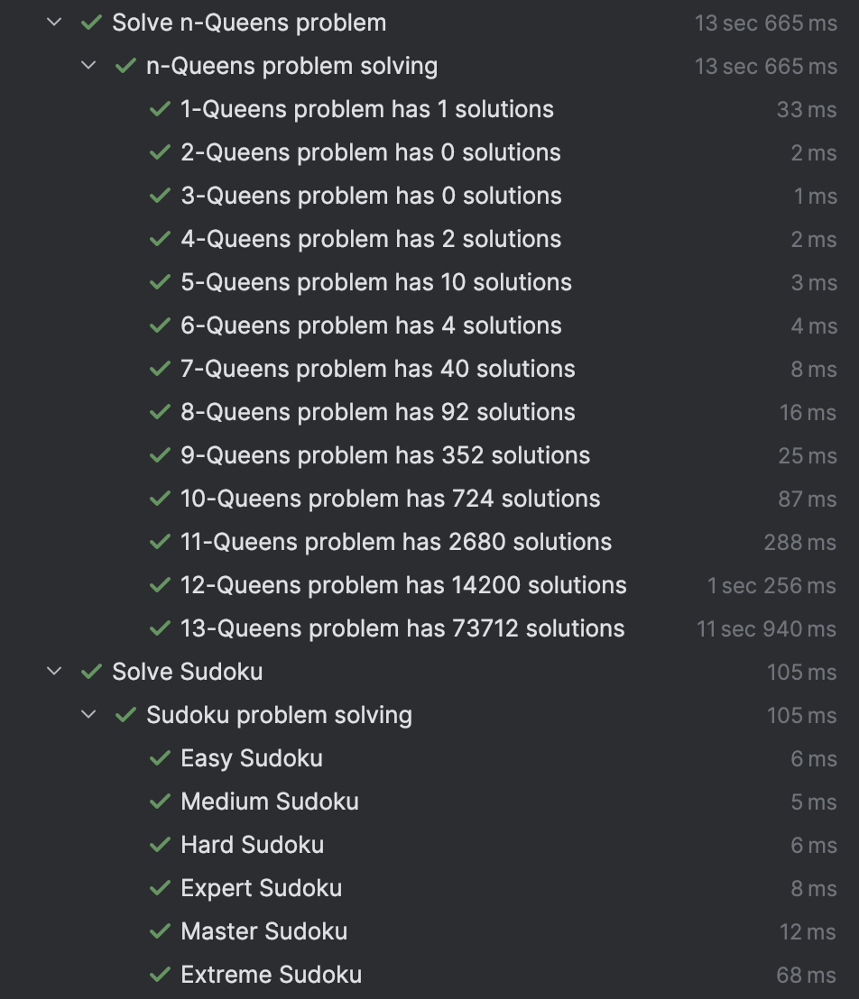

## Introduction to the ZBDD Java Library

### Introduction
Zero-Suppressed Binary Decision Diagrams (ZBDDs), introduced by Shin Ichi Minato, are a compact data structure for
representing and manipulating large collections of sets or combinations from a universe of variables. Each ZBDD is a 
directed acyclic graph where nodes correspond to variables, and edges indicate the absence (0-edge) or presence (1-edge)
of a variable in a combination, with zero-suppression rules eliminating redundant nodes to optimize for sparse datasets.
This enables efficient storage and computation for tasks such as enumerating subsets, performing algebraic operations 
on set families, and solving combinatorial problems in areas like optimization and data analysis.

### ZBDD Library
This Java library offers a robust implementation of ZBDDs, supporting essential operations for constructing and 
querying these structures. The basic operations include creating an empty ZBDD, generating a base ZBDD 
(representing the empty set), changing variable assignments, extracting subsets where a variable is absent (subset0) or 
present (subset1), computing differences (diff), unions, intersections, and counting the number of combinations.

Beyond these fundamentals, the library provides advanced algebraic capabilities: multiply for calculating the product 
of two ZBDD sets, divide for determining the quotient, and modulo for finding the remainder. It also includes 
removeBase to exclude the base element from a ZBDD set, and atomize to produce a new ZBDD containing only the
single-variable elements present in the original.

The library includes a factory mechanism for instantiating either regular or cached ZBDD
instances, enhancing performance through memoization where needed. Additionally, the factory allows wrapping any ZBDD 
instance to make it thread-safe, supporting concurrent applications without compromising integrity.

### Test Suite
The library's comprehensive test suite demonstrates its practical efficacy through real-world combinatorial challenges,
including solutions to the n-Queens problem across grid sizes from 1x1 to 13x13, as well as Sudoku puzzles spanning 
easy to extreme difficulty levels.

