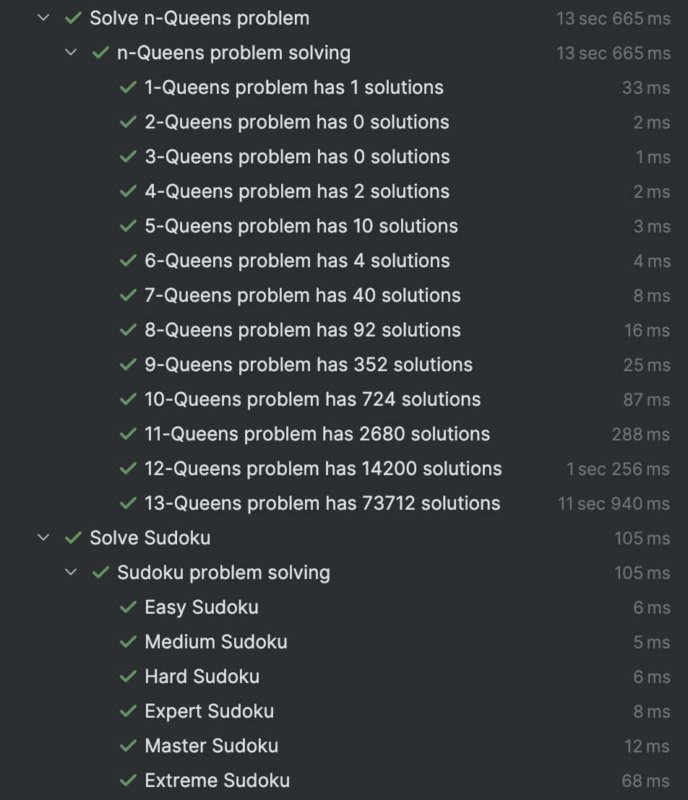

# Java ZBDD Library

[](https://www.apache.org/licenses/LICENSE-2.0)
[](https://openjdk.org/)
[](https://central.sonatype.com/artifact/de.sayayi.lib/zbdd)

A Java implementation of Shin-ichi Minato's **Zero-Suppressed Binary Decision Diagrams (ZBDDs)** for efficient
representation and manipulation of families of sets.

---

## What are ZBDDs?

[Zero-Suppressed Binary Decision Diagrams (ZBDDs)][zbdd-paper] are a compact data structure for efficiently
representing and manipulating large collections of sets (also called *families of sets* or *combinatorial sets*)
selected from a set of variables.

Each ZBDD is a directed acyclic graph where:
- **Nodes** represent variables.
- **Edges** indicate whether a variable is *included* (1-edge) or *excluded* (0-edge) from a combination.
- **Zero-suppression** automatically eliminates redundant nodes, maintaining a compact representation that is
  particularly beneficial for sparse data.

This makes ZBDDs well-suited for problems involving combinatorial constraints, subset enumeration, and set-family
algebra — such as solving constraint satisfaction problems, configuration analysis, and combinatorial optimization.

> See also: [Zero-suppressed decision diagram](https://en.wikipedia.org/wiki/Zero-suppressed_decision_diagram)
> on Wikipedia.

---

## Features

- **Core set operations** — `union`, `intersection`, `difference`, `subset0`, `subset1`, `change`, and `count`
- **Algebraic operations** — `multiply` (Cartesian product), `divide` (quotient), and `modulo` (remainder)
- **Set manipulation** — `cube`, `atomize`, and `removeBase`
- **Set queries** — `contains` and `hasCubeWithVar`
- **Operation caching** — optional memoization of operation results via a pluggable cache (`ZbddCache`)
- **Thread safety** — any ZBDD instance can be wrapped for concurrent access
- **Memory management** — reference counting with automatic garbage collection of unused nodes
- **Configurable capacity** — pluggable capacity advisor for fine-tuning node allocation and GC behavior
- **Traversal** — visitor-based cube and ZBDD-node traversal
- **Statistics** — live view on node usage, capacity, lookup hit ratios, and GC activity
- **Java Module System** — ships as module `de.sayayi.lib.zbdd`
- **No runtime dependencies**

---

## Requirements

- **Java 21** or later

---

## Installation

### Gradle

```groovy
dependencies {
  implementation 'de.sayayi.lib:zbdd:0.6.0'
}
```

### Maven

```xml
<dependency>
  <groupId>de.sayayi.lib</groupId>
  <artifactId>zbdd</artifactId>
  <version>0.6.0</version>
</dependency>
```

---

## Quick Start

```java
import de.sayayi.lib.zbdd.Zbdd;
import de.sayayi.lib.zbdd.ZbddFactory;

// Create a ZBDD instance
Zbdd zbdd = ZbddFactory.create();

// Create variables
int a = zbdd.createVar();
int b = zbdd.createVar();
int c = zbdd.createVar();

// Assign readable names to variables
zbdd.setLiteralResolver(var -> var == a ? "a" : var == b ? "b" : "c");

// Build cubes (combinations)
int ab = zbdd.incRef(zbdd.cube(a, b));  // the combination {a, b}
int ac = zbdd.incRef(zbdd.cube(a, c));  // the combination {a, c}

// Perform set operations
int set = zbdd.union(ab, ac, zbdd.cube(b));  // { a.b, a.c, b }
System.out.println(zbdd.toString(set));      // "{ a.b, a.c, b }"
System.out.println(zbdd.count(set));         // 3
```

---

## API Overview

### Creating Instances

The `ZbddFactory` provides factory methods for creating ZBDD instances:

```java
// Basic instance (no caching, not thread-safe)
Zbdd zbdd = ZbddFactory.create();

// With a custom capacity advisor
Zbdd zbdd = ZbddFactory.create(myCapacityAdvisor);

// With operation caching (recommended for complex computations)
Zbdd.WithCache zbdd = ZbddFactory.createCached(new ZbddFastCache(65536));

// Thread-safe wrapper
Zbdd.Concurrent zbdd = ZbddFactory.asConcurrent(existingZbdd);

// Thread-safe wrapper with cache support
var zbdd = ZbddFactory.asConcurrent(
    ZbddFactory.createCached(new ZbddFastCache(65536)));
```

### Variables and Cubes

```java
// Create variables (each represents a literal in the ZBDD)
int x = zbdd.createVar();

// Create a variable with an associated object
int y = zbdd.createVar("my-label");
String label = zbdd.getVarObject(y);  // "my-label"

// Build cubes (single combinations of variables)
int cube1 = zbdd.cube(x);     // { x }
int cube2 = zbdd.cube(x, y);  // { x.y }
```

### Set Operations

| Method                          | Description                                                          |
|---------------------------------|----------------------------------------------------------------------|
| `union(p, q)`                   | All combinations in either `p` or `q`                                |
| `intersect(p, q)`               | Only combinations in both `p` and `q`                                |
| `difference(p, q)`              | Combinations in `p` but not in `q`                                   |
| `multiply(p, q)`                | Cartesian product of `p` and `q`                                     |
| `divide(p, q)`                  | Quotient — combinations that produce `p` when multiplied by `q`      |
| `modulo(p, q)`                  | Remainder of the division                                            |
| `subset0(zbdd, var)`            | Combinations where `var` is **absent**                               |
| `subset1(zbdd, var)`            | Combinations where `var` is **present** (with `var` removed)         |
| `change(zbdd, var)`             | Toggle `var` in all combinations                                     |
| `contains(p, q)`                | Test whether `q` is a subset of `p`                                  |
| `hasCubeWithVar(zbdd, var)`     | Test whether any combination contains `var`                          |
| `atomize(zbdd)`                 | Extract all individual variables as single-variable cubes            |
| `removeBase(zbdd)`              | Remove the empty combination (base) from the set                     |
| `count(zbdd)`                   | Number of combinations in the set                                    |

### Reference Counting and Garbage Collection

ZBDD nodes are managed through reference counting. Nodes with a reference count greater than zero are protected
from garbage collection:

```java
int result = zbdd.incRef(zbdd.union(a, b));  // protect from GC

// ... perform operations ...

zbdd.decRef(result);  // allow GC to reclaim if no longer needed
zbdd.gc();            // explicitly trigger garbage collection
```

> **Note:** All ZBDD operations automatically protect their input parameters by incrementing reference counts on
> entry and decrementing on exit.

### Traversal

```java
// Visit all cubes as variable arrays
zbdd.visitCubes(mySet, vars -> {
    System.out.println(Arrays.toString(vars));
    return true;  // return false to stop early
});

// Visit all cubes as individual ZBDD nodes
zbdd.visitCubeZbdds(mySet, singleCubeZbdd -> {
    System.out.println(zbdd.toString(singleCubeZbdd));
    return true;
});

// Convert to array of single-cube ZBDDs
int[] cubes = zbdd.asSingleCubeZbdds(mySet);
```

### Caching

The `ZbddFastCache` provides high-performance memoization for all ZBDD operations:

```java
Zbdd.WithCache zbdd = ZbddFactory.createCached(new ZbddFastCache(65536));

// Access or replace the cache at any time
ZbddCache cache = zbdd.getZbddCache();
zbdd.setZbddCache(new ZbddFastCache(131072));
```

You can also implement the `ZbddCache` interface for a custom caching strategy.

### Thread Safety

```java
// Wrap any ZBDD instance for thread-safe access
Zbdd.Concurrent concurrent = ZbddFactory.asConcurrent(zbdd);

// Perform multiple operations atomically
concurrent.doAtomic(z -> {
    int r = z.union(a, b);
    z.incRef(r);
});
```

### Statistics

```java
ZbddStatistics stats = zbdd.getStatistics();

stats.getNodesCapacity();       // total node capacity
stats.getOccupiedNodes();       // actively used nodes
stats.getFreeNodes();           // unused node slots
stats.getDeadNodes();           // nodes eligible for GC
stats.getGCCount();             // number of GC runs
stats.getGCFreedNodes();        // cumulative freed nodes
stats.getNodeLookupHitRatio();  // cache hit ratio (0.0 – 1.0)
stats.getMemoryUsage();         // estimated memory in bytes
stats.getRegisteredVars();      // number of registered variables
```

### Callbacks

Register lifecycle callbacks for clear and GC events:

```java
zbdd.registerCallback(new Zbdd.ZbddCallback() {
    @Override public void beforeGc()  { /* ... */ }
    @Override public void afterGc()   { /* ... */ }
    @Override public void beforeClear() { /* ... */ }
    @Override public void afterClear()  { /* ... */ }
});
```

---

## Examples

The test suite demonstrates the library on real-world combinatorial problems:

- **N-Queens** — Solves the N-Queens problem for board sizes 1×1 through 13×13 using ZBDD-based constraint
  propagation with `subset0` and `change` operations.
- **Sudoku** — Solves Sudoku puzzles ranging from easy to extreme difficulty by incrementally building a 
  constraint-based ZBDD solution.



---

## Module System

The library is a named Java module:

```java
module your.module {
  requires de.sayayi.lib.zbdd;
}
```

Exported packages:
- `de.sayayi.lib.zbdd` — Core API (`Zbdd`, `ZbddFactory`, `ZbddCapacityAdvisor`, `ZbddLiteralResolver`, `ZbddStatistics`)
- `de.sayayi.lib.zbdd.cache` — Cache API (`ZbddCache`, `ZbddFastCache`)
- `de.sayayi.lib.zbdd.exception` — Exceptions (`ZbddException`, `InvalidVarException`, `InvalidZbddException`, `ZbddOutOfRangeException`)

---

## License

This project is licensed under the [Apache License, Version 2.0](https://www.apache.org/licenses/LICENSE-2.0).

---

## Author

**Jeroen Gremmen**

- GitHub: [jgremmen](https://github.com/jgremmen)

---

## References

- Shin-ichi Minato, [*"Zero-Suppressed BDDs for Set Manipulation in Combinatorial Problems"*][zbdd-paper], DAC '93
- [Zero-suppressed decision diagram](https://en.wikipedia.org/wiki/Zero-suppressed_decision_diagram) — Wikipedia

[zbdd-paper]: https://dl.acm.org/doi/pdf/10.1145/157485.164890 "Zero-Suppressed BDDs for Set Manipulation in Combinatorial Problems"
